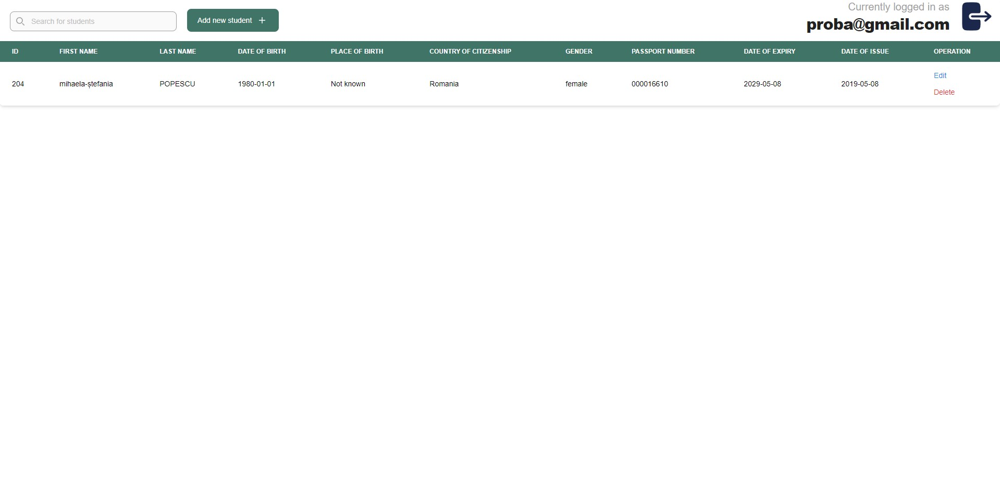
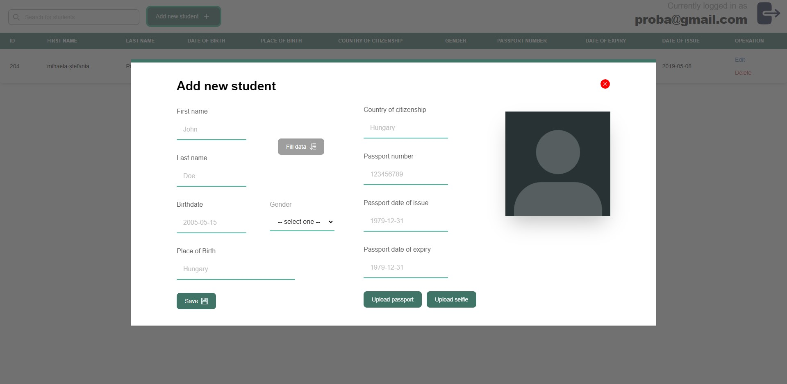
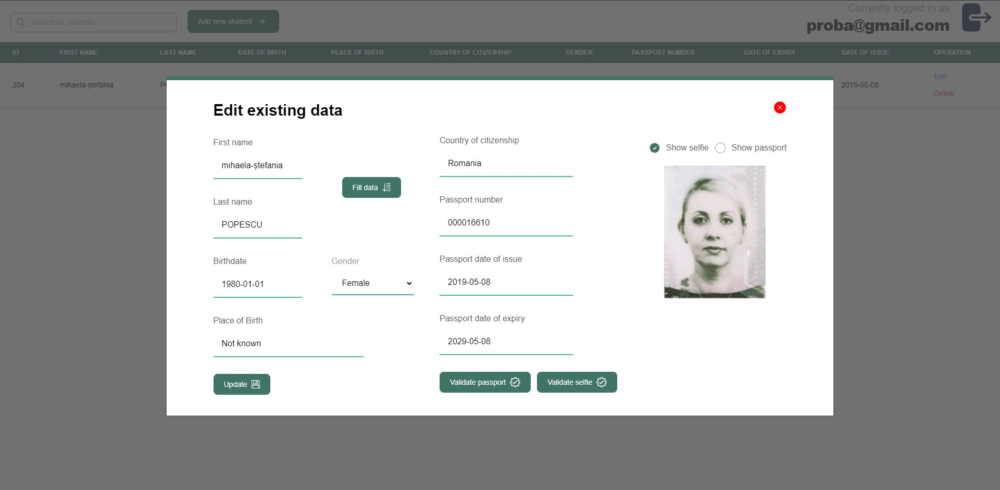
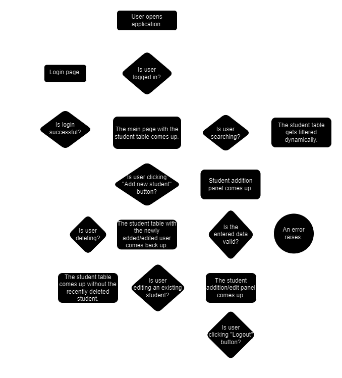

<div id="top"></div>

<br />
<div align="center">

<h1 align="left">Student manager</h1>

  <p align="center">
    This application lets authorized users to register students into a database.
    <br />
    <a href="https://markvarga21.github.io/studentManager/javadoc"><strong>Explore the docs »</strong></a>
    <br />
    <a href="https://github.com/markvarga21/studentManager/issues">Report Bug</a>
    ·
    <a href="https://github.com/markvarga21/studentManager/issues">Request Feature</a>
  </p>
</div>

<details>
  <summary>Table of Contents</summary>
  <ol>
    <li>
      <a href="#about-the-project">About The Project</a>
      <ul>
        <li><a href="#built-with">Built With</a></li>
      </ul>
    </li>
    <li><a href="#screenshots">Screenshots</a></li>
    <li>
      <a href="#getting-started">Getting Started</a>
      <ul>
        <li><a href="#prerequisites">Prerequisites</a></li>
        <li><a href="#installation">Installation</a></li>
      </ul>
    </li>
    <li><a href="#flowchart">Flowchart</a></li>
    <li><a href="#known-bugs">Known bugs</a></li>
    <li><a href="#contact">Contact</a></li>
<li><a href="#license">License</a></li>
  </ol>
</details>

## About The Project

<i>This repository is just a part of the whole application, but for easing its usage and the overall installation process, the documentation, the features and the necessary steps are listed and presented in this README below.</i>

### - Student manager API -

This Spring Boot application lets you to manage students. It can store their name, birthdate, birthplace, gender, country of citizenship, passport number and the dates of expiry and issue of the passport.

It also provides accurate validation on the entered data. It allows authorized users to upload a passport and also a selfie. The application uses <a href="https://azure.microsoft.com/en-us/products/ai-services/ai-document-intelligence">Azure's Document Intelligence</a> service to validate the entered data against the data found on the passport.

In addition, it validates the photo on the passport against the uploaded selfie taken by the student. For this, it uses [Azure's AI Vision](https://azure.microsoft.com/en-gb/products/ai-services/ai-vision).

On the persistence part, the application uses a PostgreSQL database which is being hosted locally.

Also, the application follows the code-styling rules listed in the `checkstyle.xml` file, thus resulting a more readable and extendable codebase. Some parts of the main service class was also tested using Mockito.

For the CI/CD pipeline, the application uses GitHub Actions. The pipeline is triggered on every push to the main branch. There are several pipelines involved in the process. The first one is for checking the code quality, the second one for testing the application and the last one for building the application using a custom made Dockerfile and pushing it to the Docker Hub.

Finally, the whole application is fully containerized and can be found in <a href="https://hub.docker.com/r/markvarga21/studentmanager">this</a> Docker repository (more on this later).

The API documentation can be found on this <a href="https://documenter.getpostman.com/view/22391147/2s9Y5SWRBz">link</a>.

---

### - Frontend -

This connects the applications backend with the user. It was built using React JS and for the styling Tailwind CSS was used.

The frontend also has the ability to inform the user about an error or exception in a custom error panel.

Also, the frontend is designed to be responsive, so it can be used on almost any modern device.

The frontend is also containerized using Docker, and can be found on this repository: <a href="https://hub.docker.com/r/markvarga21/studentmanagerfrontend">link</a>.

<a href="https://github.com/markvarga21/studentManagerFrontend">Link to the frontend repository</a>

<p align="right">(<a href="#top">back to top</a>)</p>

### Built With

**Backend**

- [Java 17](https://www.oracle.com/java/technologies/javase/jdk17-archive-downloads.html)
- [Spring Boot](https://spring.io/projects/spring-boot)
- [Maven](https://maven.apache.org/)
- [Azure Document Intelligence](https://azure.microsoft.com/en-gb/products/ai-services/ai-document-intelligence/)
- [Azure AI Vision](https://azure.microsoft.com/en-us/products/ai-services/ai-vision)
- [PostgreSQL](https://www.postgresql.org/)
- [Mockito](https://site.mockito.org/)
- [Docker](https://www.docker.com/)

**Frontend**

- [React JS](https://react.dev/)
- [Tailwind CSS](https://tailwindcss.com/)
- [Docker](https://www.docker.com/)

<p align="right">(<a href="#top">back to top</a>)</p>

<div id="screenshots"></div>

## Screenshots

The main page of the application showing the students in a table:


The student addition page:


Edit student page:


Login page:


<p align="right">(<a href="#top">back to top</a>)</p>

## Getting Started

In this section you can see a step-by-step guide in order to start and use the application.

### Prerequisites

Here you can find the only, but the most important one, prerequisity to run the application:

- **Docker**
  <br>See: https://www.docker.com/

### Installation

1. Install Docker desktop and then open it.
   <br>See: https://docs.docker.com/desktop/install/windows-install/
2. Request an admin or me to provide you the `docker-compose.yaml` file.
3. Build the docker container using the provided `docker-compose.yaml` with the next command.
   ```sh
   docker compose up --detach
   ```
   This file is provided by me or by an admin for safety reasons. Also, make sure you run this command in the same directory you've put the `docker-compose.yaml` file into.
4. Open the page in any browser using the link below
   ```
   http://localhost:3000/
   ```
   If you are planning to use the application in a production environment, feel free to request the kickstart script from me or from an admin.

<p align="right">(<a href="#top">back to top</a>)</p>

<div id="known-bugs"></div>

<div id="flowchart"></div>

## Flowchart



<p align="right">(<a href="#top">back to top</a>)</p>

## Known Bugs

As any application, this contains some bugs and some sensitive parts too which are:

- The application is only tested for romanian and hungarian passports due to privacy reasons. This means, that there is no legitimate way to test the application with other passports.
- The application (backend + frontend) is not fully tested yet.

<p align="right">(<a href="#top">back to top</a>)</p>

## Contact

József Márk Varga - vmark2145@gmail.com

## License

<div id="license"></div>
Copyright (c) 2024 Department of Informatics, University of Debrecen

All rights reserved.

This code and the information contained within are proprietary to the Department of Informatics, University of Debrecen.
This code may not be reproduced, used, or disclosed without the written permission of Department of Informatics, University of Debrecen.

<p align="right">(<a href="#top">back to top</a>)</p>

[](https://codecov.io/gh/markvarga21/studentManager)
